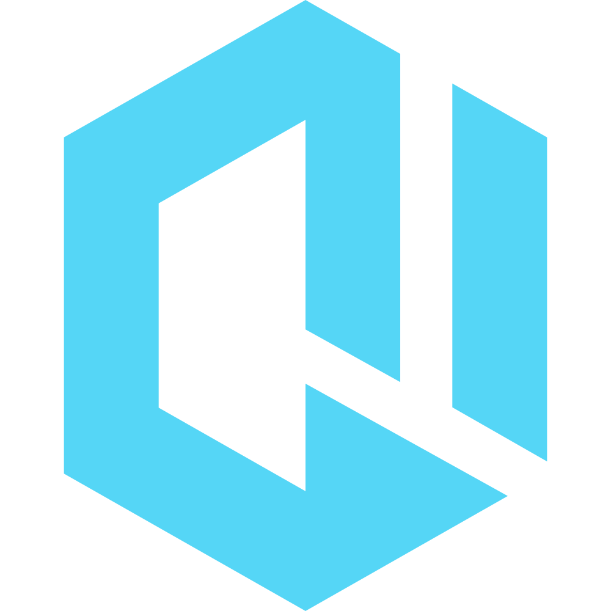
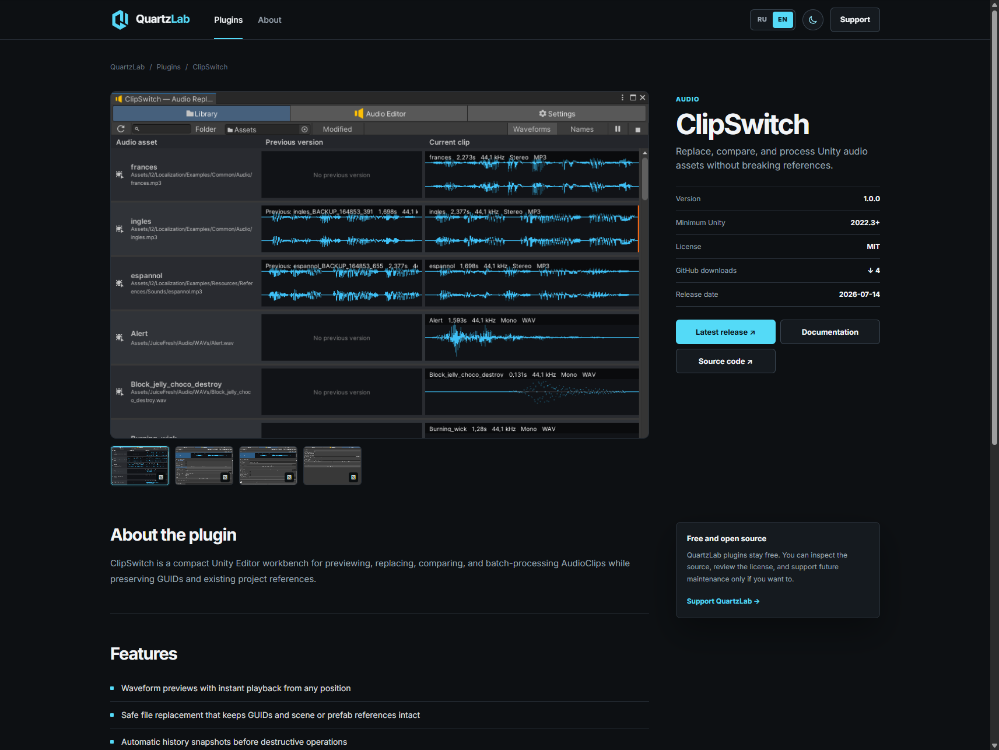

[English](README.md) · [Русский](README.ru.md)

<p align="center">
  
</p>

# QuartzLab site

Static bilingual catalog and documentation site for QuartzLab Unity Editor plugins.

[Open quartzlab.ru](https://quartzlab.ru)

[](https://github.com/quartz-lab/quartzlab-site/actions/workflows/pages.yml)
[](https://quartzlab.ru)

[](LICENSE)

## Features

- Static RU/EN catalog with no runtime data fetching.
- Automatic synchronization with published GitHub Releases.
- Generated plugin pages and web copies of plugin documentation.
- Deterministic content fingerprinting for CSS and JavaScript.
- Clean GitHub Pages deployment for the custom domain.

<p align="center">
  
</p>

## Quick start

Node.js 22 or newer is required. The project has no runtime dependencies.

```sh
npm run build
npm run validate
npm test
npm run dev
```

The local preview is available at `http://127.0.0.1:4173/`.

## Repository layout

```text
.github/workflows/  GitHub Pages automation
catalog/            manually maintained plugin metadata
scripts/            build, synchronization, validation, and preview tools
site/               editable styles, scripts, images, and SVG assets
tests/              unit and integration tests
docs/               technical and operational documentation
_site/              generated deployment artifact (ignored)
```

## Documentation

- [Architecture](docs/ARCHITECTURE.md)
- [Development](docs/DEVELOPMENT.md)
- [Deployment](docs/DEPLOYMENT.md)
- [Maintenance mode](docs/MAINTENANCE.md)
- [Adding a plugin](docs/ADDING_PLUGIN.md)
- [Contributing](CONTRIBUTING.md)
- [Security](SECURITY.md)

## License

The site source and generator are available under the [MIT License](LICENSE). Brand assets and plugin licenses are described in [NOTICE.md](NOTICE.md).

Maintainer: [QuartzLab](https://github.com/quartz-lab)
